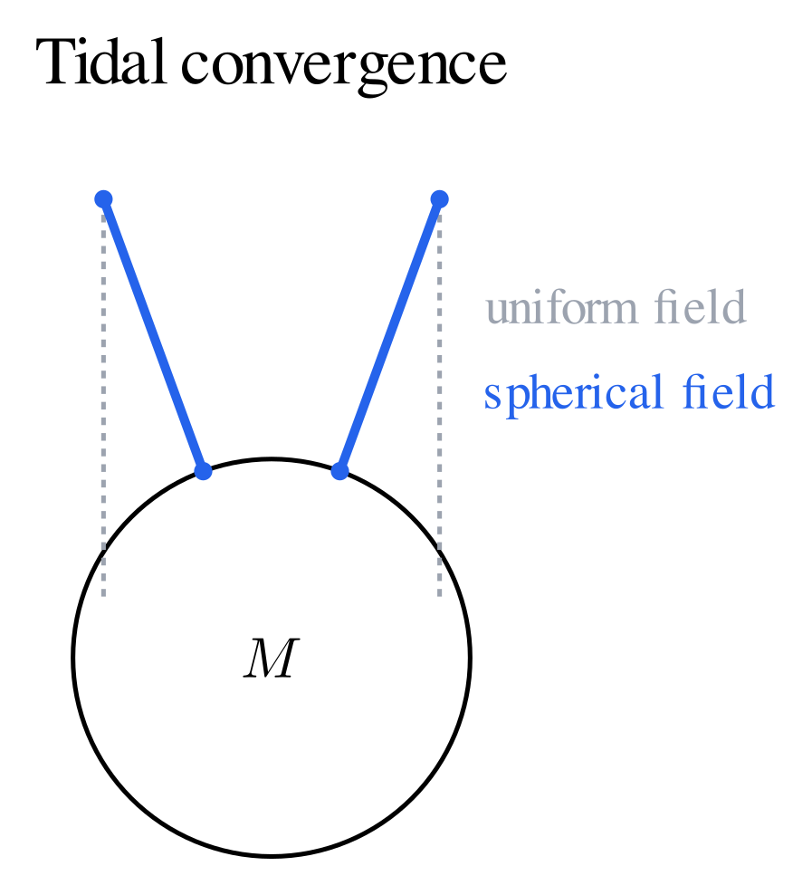
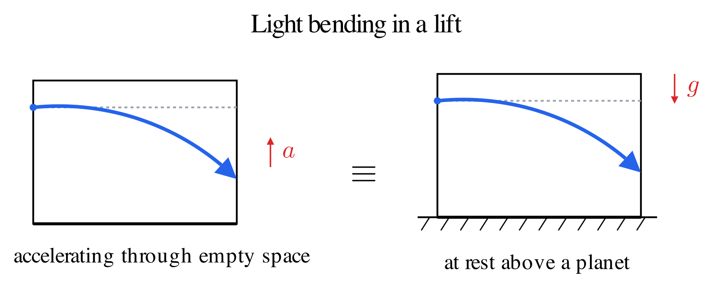

# The Equivalence Principle

Drop different test bodies in the same gravitational field and, after accounting for nongravitational forces, they follow the same trajectory from the same initial conditions. This universality makes a geometric description possible: the path can depend on spacetime and initial velocity rather than on the body's composition.

## 1. Newtonian Gravity and Free Fall

For a spherical source of mass $M$, Newton's gravitational force on a test body is

$$\mathbf F=-\frac{GMm_g}{r^2}\hat{\mathbf r}.$$

The Newtonian potential is $\Phi=-GM/r$, and gravitational acceleration is $\mathbf g=-\nabla\Phi$. For a general mass density $\rho$, Poisson's equation $\nabla^2\Phi=4\pi G\rho$ determines the potential with suitable boundary conditions.

Newtonian gravity treats this field as a force acting in space with a shared absolute time. We will retain its successful slow-motion predictions while replacing that spacetime description.

Newtonian mechanics distinguishes inertial mass $m_i$, the resistance to acceleration, from gravitational mass $m_g$, the coupling to a gravitational field:

$$m_i\mathbf a=m_g\mathbf g.$$

If $m_g/m_i$ is the same for all test bodies, they share the same acceleration. The **weak equivalence principle** states this universality for freely falling test bodies. A test body is small enough that its own gravity and finite-size effects can be neglected.

This principle does not assert that every extended object follows exactly the same motion. Spin, tidal deformation, and self-gravity require more detailed equations.

## 2. A Falling Laboratory

A freely falling laboratory and an unsupported object inside it have nearly the same gravitational acceleration. The object therefore floats relative to the laboratory. An accelerometer carried by the lab reads zero.

For an approximately uniform gravitational acceleration, write a body's position as $\mathbf x=\mathbf X(t)+\boldsymbol\xi$, where $\mathbf X$ is the laboratory's position and $\boldsymbol\xi$ is position relative to it. Then

$$\ddot{\boldsymbol\xi}=\mathbf g-\ddot{\mathbf X}.$$

If the laboratory falls with $\ddot{\mathbf X}=\mathbf g$, the relative acceleration vanishes. If it accelerates with $\mathbf a$ in a gravity-free region, the body has relative acceleration $-\mathbf a$. This is the Newtonian form of the local gravity–acceleration correspondence.

A laboratory supported on the ground behaves differently. The floor exerts a force, and an accelerometer records nonzero proper acceleration. Inside a sufficiently small region, this resembles a rocket accelerating through gravity-free spacetime.

The **Einstein equivalence principle** extends universal free fall: local nongravitational experiments in a freely falling laboratory have the special-relativistic form, independent of the laboratory's location and velocity. This motivates describing matter with a locally Minkowskian metric. It does not uniquely determine the Einstein field equations; alternative metric theories can also satisfy it.

## 3. The Limits of a Local Description

A freely falling coordinate system can remove the connection at one event. It cannot generally remove curvature over a finite region.

Two particles dropped at slightly different positions above a spherical body move toward its center. Their separation changes even though both fall freely. This **tidal effect** depends on the variation of the gravitational field, and in general relativity on the Riemann tensor.

The useful laboratory must be small in space and short in duration compared with the scales over which these effects become measurable. “Local” expresses this physical restriction; it does not imply that gravity disappears throughout an extended elevator.

## 4. Light Bending in a Lift

The lift also shows why gravity should bend light, if the beam crosses it sideways instead of climbing straight up. Send a pulse through a small hole in one wall while the lift accelerates upward through gravity-free space. Outside the lift, in flat space, the pulse travels in a straight line at a fixed height. But the lift keeps gaining speed during the crossing, so relative to the cabin the pulse arrives at the far wall lower than it entered, and its path inside the lift looks bent toward the floor.

Now hold a laboratory stationary in a real gravitational field instead. The Einstein equivalence principle says no local experiment can tell this laboratory apart from the accelerating one, since both give an accelerometer the same reading. So a beam of light passing a real gravitating mass should curve toward it too.

This equivalence-principle argument alone underestimates the bending, because it only accounts for how gravity dilates time and leaves out how it curves space. The full general-relativistic deflection, worked out in [Lensing and Redshift](lensing-and-redshift.md), comes out twice as large. Einstein's first estimate in 1911 relied on the equivalence principle alone and predicted the smaller value, and the doubled 1915 prediction is what the 1919 eclipse expedition set out to test.

The lift shows how far free fall and local equivalence can reach on their own. They already predict that gravity bends light, without invoking a metric at all. [Tensors and Tensor Fields](tensors-and-tensor-fields.md) builds the notation needed to state this precisely, [Metric for a Gravitational Field](metric-for-a-gravitational-field.md) derives $g_{00}$ and the exact deflection formula, and [The Einstein Field Equations](einstein-equations.md) adds the dynamical law relating the metric to matter and energy.
