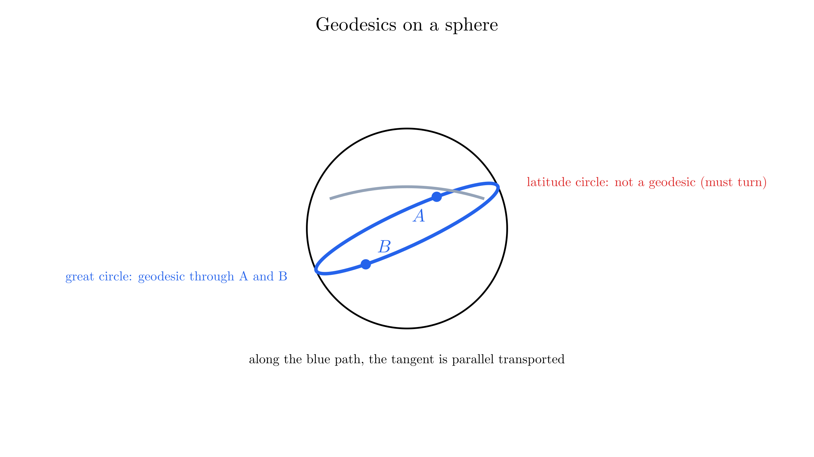
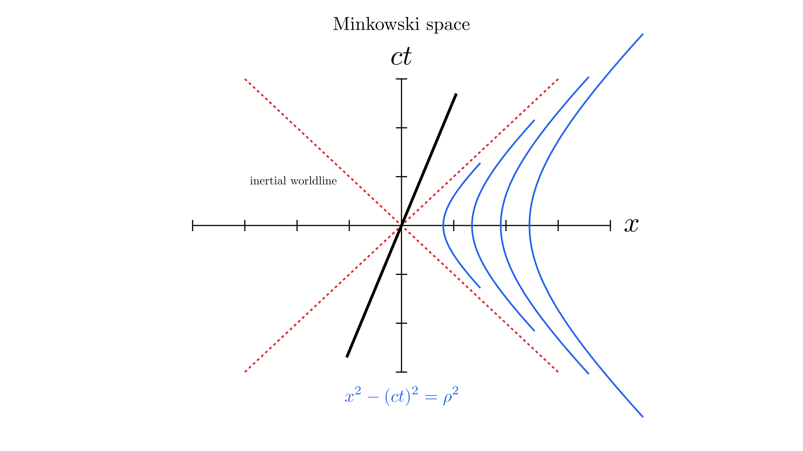
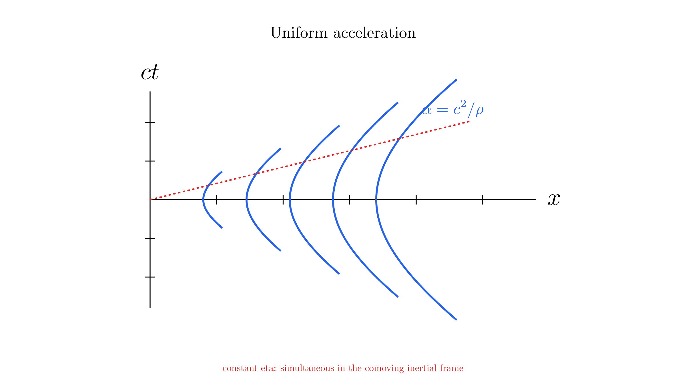
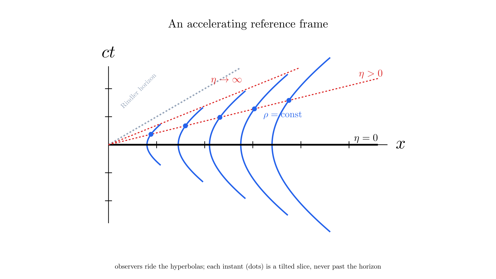
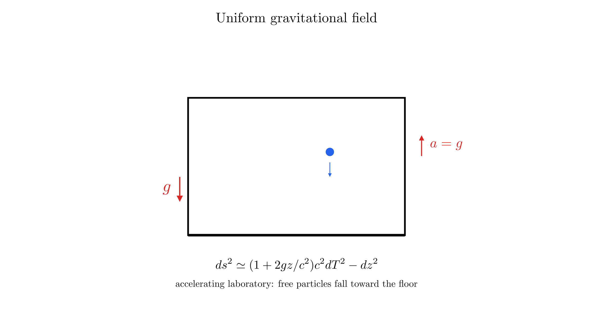

# Geodesics

A freely falling particle follows the spacetime version of a straight line: its tangent stays parallel to itself as it moves. This definition works in both flat and curved spacetime. It also explains why a particle can accelerate in some coordinates while an accelerometer travelling with it reads zero.

We use signature $(+,-,-,-)$ and the metric-compatible, torsion-free **Levi-Civita connection**. In inertial coordinates, $x^0=ct$.

## Parallel Transport

Vectors at different points belong to different tangent spaces. To compare them along a curve $x^\mu(\lambda)$, we need a rule for carrying a vector from one tangent space to the next. The connection supplies this rule.

Let $v^\mu=dx^\mu/d\lambda$ be the curve's tangent and $V^\mu(\lambda)$ a vector along it. Its covariant derivative along the curve is

$$\frac{DV^\mu}{d\lambda}=v^\nu\nabla_\nu V^\mu=\frac{dV^\mu}{d\lambda}+\Gamma^\mu{}_{\alpha\beta}v^\alpha V^\beta.$$

The vector is **parallel transported** when

$$\frac{DV^\mu}{d\lambda}=0.$$

Its coordinate components need not be constant: the connection term accounts for the changing coordinate basis. Given an initial vector and a specified path, this equation determines the transported vector along the path.

For an infinitesimal displacement, multiply the transport equation by $d\lambda$:

$$dV^\mu=-\Gamma^\mu{}_{\alpha\beta}V^\beta\,dx^\alpha.$$

This tells us exactly how to adjust the components at the next point. In normal coordinates at the starting point, the connection vanishes there and the components stay unchanged to first order. At the next point we can choose another normal frame and repeat. Parallel transport joins these local comparisons into a rule along the entire curve; it does not require a single Cartesian frame covering the path.

Metric compatibility, $\nabla_\alpha g_{\mu\nu}=0$, means parallel transport preserves inner products. If $V$ and $W$ are both parallel transported, then

$$\frac{d}{d\lambda}g(V,W)=g\left(\frac{DV}{d\lambda},W\right)+g\left(V,\frac{DW}{d\lambda}\right)=0.$$

In curved geometry the result can depend on the path. Carrying a vector around a small closed loop can change its direction; curvature measures this failure to return unchanged. See [Tong, parallel transport](https://www.davidtong.org/teaching/general-relativity/grhtml/S3#S3.SS3) for the covariant formulation.

## Tangent Vectors and Geodesics

First consider a curve on a Riemannian surface, where arc length $\ell$ obeys $d\ell^2=g_{ab}dx^a dx^b$. Its unit tangent is

$$t^a=\frac{dx^a}{d\ell},\qquad g_{ab}t^at^b=\frac{g_{ab}dx^a dx^b}{d\ell^2}=1.$$

Imagine guiding a very small vehicle over the surface without steering to either side in its local tangent plane. Its direction can change when viewed from the surrounding three-dimensional space, because the surface bends. Intrinsically, however, it keeps heading straight ahead. The condition expressing this is $Dt^a/d\ell=0$.

Substituting $t^a=dx^a/d\ell$ into the parallel-transport equation turns the derivative of the tangent into a second derivative of position. This gives the geodesic equation. The same construction works in spacetime, using an appropriate parameter in place of Riemannian arc length.

A **geodesic** parallel transports its own tangent. With an affine parameter $\lambda$, its defining equation is

$$\nabla_vv=0,$$

or, in coordinates,

$$\boxed{\frac{d^2x^\mu}{d\lambda^2}+\Gamma^\mu{}_{\alpha\beta}\frac{dx^\alpha}{d\lambda}\frac{dx^\beta}{d\lambda}=0.}$$

This is a second-order equation: an initial event and initial tangent determine a local solution. Because the tangent is parallel transported, $g(v,v)$ is constant. A geodesic therefore retains its timelike, null, or spacelike character.

For a massive particle, proper time $\tau$ is an affine parameter. Its tangent is the four-velocity $u^\mu=dx^\mu/d\tau$, with $g(u,u)=c^2$, and its four-acceleration is

$$a^\mu=\frac{Du^\mu}{d\tau}.$$

Free fall means $a^\mu=0$. This does not require $d^2x^\mu/d\tau^2=0$: coordinate acceleration can be cancelled by the connection term.

For light, $g(v,v)=0$ and proper time cannot parameterize the path. Use another affine parameter. Affine parameters can be rescaled and shifted, $\lambda\mapsto A\lambda+B$, with constant $A\ne0$. A general parameter $s$ instead gives

$$\frac{d^2x^\mu}{ds^2}+\Gamma^\mu{}_{\alpha\beta}\frac{dx^\alpha}{ds}\frac{dx^\beta}{ds}=f(s)\frac{dx^\mu}{ds},$$

where the tangent term reflects the parameter choice, not a force.

### Reusing the Sphere Calculation

In [Spacetime, under Curvature](spacetime.md#curvature), we already gave the sphere's connection coefficients and used them to calculate its curvature. For radius $a$ and **colatitude** $\theta$ measured from the north pole,

$$d\ell^2=a^2(d\theta^2+\sin^2\theta\,d\phi^2),$$

$$\Gamma^\theta{}_{\phi\phi}=-\sin\theta\cos\theta,\qquad
\Gamma^\phi{}_{\theta\phi}=\Gamma^\phi{}_{\phi\theta}=\cot\theta.$$

We can now use these results directly. With primes denoting $d/d\ell$, the geodesic equations are

$$\theta''-\sin\theta\cos\theta\,(\phi')^2=0,\qquad
\phi''+2\cot\theta\,\theta'\phi'=0.$$

Along a meridian, $\phi=\phi_0$ and $\theta=\theta_0+\ell/a$ for motion toward increasing colatitude. Thus $\phi'=0$, $\theta'=1/a$, and both equations hold. Its unit tangent $(1/a,0)$ is parallel transported along the meridian. The polar coordinate chart fails at the poles, but the geodesic continues smoothly in another chart.

A circle of constant colatitude behaves differently. With $\theta'=0$ and $\phi'\ne0$, the first equation requires $\sin\theta\cos\theta=0$. Away from the coordinate poles, this selects the equator, $\theta=\pi/2$. Other latitude circles require sideways steering. Rotating the sphere carries the equator into any great circle, so every great circle is a geodesic.

The tangent to a great circle still turns in the surrounding Euclidean space. That change points normally to the sphere; its component within the tangent plane is zero. This is why a changing three-dimensional arrow can nevertheless have zero intrinsic covariant derivative along the curve.

The book uses latitude $\vartheta=\pi/2-\theta$, giving $\cos^2\vartheta$ in the metric, $\Gamma^\vartheta{}_{\phi\phi}=\sin\vartheta\cos\vartheta$, and $\Gamma^\phi{}_{\vartheta\phi}=-\tan\vartheta$. These describe the same geometry in a different coordinate convention.

### Straightest Paths and Extremal Length

A Riemannian geodesic makes length stationary under small variations of the path with endpoints fixed. Sufficiently short segments minimize length, but a long geodesic need not be the shortest route: the longer great-circle arc between two non-antipodal points is also a geodesic.

In spacetime the corresponding statement for a timelike geodesic concerns proper time. Sufficiently short timelike geodesic segments locally **maximize** elapsed proper time between fixed events. The parallel-transport definition remains useful in both geometries without assuming that every geodesic is a globally shortest path.

## Minkowski Space

In inertial Cartesian coordinates $(ct,x,y,z)$, the metric is

$$ds^2=c^2dt^2-dx^2-dy^2-dz^2.$$

All connection coefficients vanish, so affine geodesics are straight coordinate lines:

$$x^\mu(\lambda)=b^\mu+v^\mu\lambda.$$

A massive free particle has constant ordinary velocity; a light ray travels at $c$. Flatness, however, does not require the metric components to be constant in every coordinate system.

The change from a positive-definite spatial metric to a Lorentzian metric changes how displacements are classified: $ds^2>0$ is timelike, $ds^2=0$ is null, and $ds^2<0$ is spacelike. The formulas for the connection and parallel transport keep their form. Flat spacetime means that locally we can find coordinates with the Minkowski metric, rather than the Euclidean identity matrix.

### From Polar Coordinates to Hyperbolic Coordinates

Ordinary polar coordinates on a plane use

$$X=r\cos\theta,\qquad Y=r\sin\theta,\qquad X^2+Y^2=r^2.$$

A fixed radius gives a circle. For a spacetime interval, the relative minus sign instead suggests $x^2-c^2t^2=\rho^2$: a hyperbola. The corresponding functions are

$$\cosh\eta=\frac{e^\eta+e^{-\eta}}2,\qquad
\sinh\eta=\frac{e^\eta-e^{-\eta}}2,$$

which obey $\cosh^2\eta-\sinh^2\eta=1$. This identity plays the role that $\cos^2\theta+\sin^2\theta=1$ plays for a circle.

To see this, introduce **hyperbolic coordinates** in the right wedge $x>|ct|$:

$$ct=\rho\sinh\eta,\qquad x=\rho\cosh\eta,\qquad \rho>0.$$

Here $\rho$ is a length and $\eta$ is dimensionless. Curves with fixed $\rho$ satisfy $x^2-c^2t^2=\rho^2$, so they are hyperbolas in a spacetime diagram. Substitution gives

$$c^2dt^2-dx^2=\rho^2d\eta^2-d\rho^2,$$

and hence

$$ds^2=\rho^2d\eta^2-d\rho^2-dy^2-dz^2.$$

Transforming the interval explicitly

Differentiate both coordinate relations:

$$c\,dt=\sinh\eta\,d\rho+\rho\cosh\eta\,d\eta,$$

$$dx=\cosh\eta\,d\rho+\rho\sinh\eta\,d\eta.$$

When we subtract the squares, the cross terms cancel. The coefficient of $d\rho^2$ is $\sinh^2\eta-\cosh^2\eta=-1$, while that of $d\eta^2$ is $\rho^2(\cosh^2\eta-\sinh^2\eta)=\rho^2$. Thus $\rho$ is a spatial coordinate and $\eta$ is a time coordinate, although $\eta$ itself has no units of time.

These are Rindler coordinates. The nonzero connection coefficients are

$$\Gamma^\rho{}_{\eta\eta}=\rho,\qquad \Gamma^\eta{}_{\rho\eta}=\Gamma^\eta{}_{\eta\rho}=\frac1\rho.$$

The spacetime is still flat: its Riemann tensor vanishes. Nonzero connection coefficients alone do not establish curvature.

## Uniform Acceleration

Relativistic **uniform acceleration** means constant proper acceleration: the magnitude measured by an accelerometer. For motion along one spatial direction, introduce rapidity $\chi$ through

$$u^\mu=(c\cosh\chi,c\sinh\chi,0,0),\qquad v=c\tanh\chi.$$

This parametrization assumes nothing: since $g(u,u)=c^2$, every four-velocity can be written with hyperbolic functions, just as every Euclidean unit vector can be written $(\cos\theta,\sin\theta)$. The parameter

$$\chi=\operatorname{artanh}\frac{v}{c}=\frac12\ln\frac{1+v/c}{1-v/c}$$

is the **rapidity**. It is the relativistic replacement for velocity. A boost along a fixed direction acts on the $(ct,x)$ plane as a hyperbolic rotation:

| Euclidean rotation | Lorentz boost |
| --- | --- |
| Unit vector $(\cos\theta,\sin\theta)$ | Four-velocity $(c\cosh\chi,c\sinh\chi)$ |
| $\cos^2\theta+\sin^2\theta=1$ | $\cosh^2\chi-\sinh^2\chi=1$ |
| Slope $\tan\theta$ | Velocity ratio $v/c=\tanh\chi$ |
| Rotations compose by adding angles: $\theta_1+\theta_2$ | Boosts compose by adding rapidities: $\chi_1+\chi_2$ |

Indeed, the velocity-composition law $(v_1+v_2)/(1+v_1v_2/c^2)$ is simply $\tanh(\chi_1+\chi_2)$. Rapidity is unbounded while $v=c\tanh\chi$ saturates below $c$. Newtonian mechanics favors velocity: a constant force makes it grow linearly forever. Special relativity keeps that statement by replacing velocity with the one quantity that still grows linearly under constant proper acceleration, $\chi=\alpha\tau/c$, without ever forcing $v$ past $c$. For everyday speeds, $\tanh\chi\simeq\chi$, so rapidity reduces to $v/c$; this is why it goes unnoticed outside relativity.

Differentiating with respect to proper time gives

$$\alpha=\sqrt{-a_\mu a^\mu}=c\left|\frac{d\chi}{d\tau}\right|.$$

For constant acceleration $\alpha>0$ toward increasing $x$, choose $\chi=\alpha\tau/c$. Integrating the four-velocity, with the particle initially at rest at $x=c^2/\alpha$, gives

$$ct=\frac{c^2}{\alpha}\sinh\left(\frac{\alpha\tau}{c}\right),\qquad x=\frac{c^2}{\alpha}\cosh\left(\frac{\alpha\tau}{c}\right).$$

Thus a fixed-$\rho$ Rindler observer has proper acceleration $\alpha=c^2/\rho$ and proper time $d\tau=\rho\,d\eta/c$. These hyperbolas are accelerated worldlines, not geodesics.

The inertial-frame velocity and acceleration are

$$v(t)=\frac{\alpha t}{\sqrt{1+(\alpha t/c)^2}},\qquad \frac{dv}{dt}=\frac{\alpha}{[1+(\alpha t/c)^2]^{3/2}}.$$

Although the accelerometer reading stays constant, coordinate acceleration decreases and the speed approaches $c$ without reaching it. The null boundaries $x=\pm ct$ delimit the Rindler wedge; the coordinate chart does not cover all of Minkowski spacetime.

### A Whole Accelerating Reference Frame

A single accelerated observer is not yet a reference frame occupying a region. To build one, assign an observer to each fixed $\rho$, the Rindler hyperbolas $x^2-c^2t^2=\rho^2$ introduced above, and let the parameter $\eta$ play the role of time for the whole family. At a common $\eta$, every observer sits at $(ct,x)=(\rho\sinh\eta,\rho\cosh\eta)$ and has the same instantaneous inertial velocity:

$$v=\frac{dx}{dt}=c\tanh\eta,$$

independent of $\rho$. The frame moves as a unit, like a rod caught in a sequence of snapshots.

Which events count as "the same instant"? At $\eta=0$ the answer is the familiar one: all observers are momentarily at rest, and the slice of simultaneous events is the positive $x$-axis. At later $\eta$ the slice tilts. Common $\eta$ does not mean common inertial time $t$: the events lie along the ray $ct=x\tanh\eta$, so for two of them

$$c\,\Delta t=\tanh\eta\,\Delta x\neq0,$$

and they are not simultaneous in the inertial frame. A Lorentz transformation to the frame moving at $v=c\tanh\eta$ gives

$$\Delta t'=\gamma\left(\Delta t-\frac{v\Delta x}{c^2}\right)=0.$$

The tilted ray is exactly the simultaneity line of the instantaneous rest frame. There is a geometric reason: the hyperbolas are centered at the origin, and in Minkowski geometry the ray from the center is the direction perpendicular to each observer's tangent there — the analogue of the radius to a circle being perpendicular to the tangent. As $\eta$ grows, the whole slice performs a hyperbolic rotation, tilting ever closer to the null line $x=ct$. The limit is real: however long the frame accelerates, its space axis approaches the horizon without reaching it; an $\eta=\infty$ slice would lie on the light cone itself.

On each slice the metric gives $d\ell=d\rho$, so the proper separation of fixed-$\rho$ observers is $|\rho_2-\rho_1|$ at every $\eta$. Each observer therefore finds all the others at unchanging distances: the frame retains its shape, and a rope laid along it develops no additional strain. This is Born rigidity.

The price is $\alpha(\rho)=c^2/\rho$: observers nearer the Rindler horizon accelerate more strongly, and clocks at larger $\rho$ tick faster, $d\tau=\rho\,d\eta/c$. The alternative — giving every observer the same acceleration at the same inertial times — would preserve their inertial-coordinate separation, as Galilean intuition expects, but the distances measured on the observers' successive rest frames would drift apart, straining and finally snapping a string laid between them (Bell's spaceship paradox). In relativity, rigidity is not a kinematic identity but a dynamical achievement: the frame keeps its shape only because its rear accelerates harder than its front. Relativity of simultaneity matters when accelerating an extended laboratory.

## Uniform Gravitational Field

To describe an accelerating laboratory, choose a reference acceleration $g>0$ and define

$$\rho=\frac{c^2}{g}+z,\qquad \eta=\frac{gT}{c}.$$

The length $R=c^2/g$ locates the reference hyperbola, so $z=\rho-R$ measures height relative to it. For $g\simeq9.8\,\mathrm{m\,s^{-2}}$, $R\simeq9.2\times10^{15}\,\mathrm m$, roughly one light-year: at 1g, rapidity grows by one in about a year of proper time, and $R$ is how far light travels in that time. An ordinary laboratory is tiny compared with this scale, which explains why its variation in proper acceleration is negligible. The Rindler horizon sits at $z=-R$, a light-year below the floor. A right-moving light ray keeps $x-ct$ constant, while an observer at height $z$ has $x-ct=(R+z)\,e^{-gT/c}>0$: signals sent from below that height can never catch the laboratory, and those sent just above it arrive ever later and ever more redshifted as $z\to-R$. This $R$ is a scale of the accelerating coordinate system, not the distance to a gravitating source.

Here $z$ replaces the longitudinal coordinate $\rho$; call the two transverse coordinates $X,Y$. The metric becomes

$$\boxed{ds^2=N(z)^2c^2dT^2-dz^2-dX^2-dY^2,\qquad N(z)=1+\frac{gz}{c^2}>0.}$$

The reference observer at $z=0$ has proper acceleration $g$, and $T$ is that observer's proper time. For another observer fixed in the laboratory,

$$d\tau=N(z)dT,\qquad \alpha(z)=\frac{g}{N(z)}.$$

Clocks higher in the laboratory accumulate more proper time per unit $T$. Observers at different heights require different proper accelerations to maintain fixed proper separations. An extended rigid accelerating laboratory therefore cannot have the same proper acceleration everywhere.

Near $z=0$, where $|gz|/c^2\ll1$, the metric reads

$$ds^2\simeq\left(1+\frac{2gz}{c^2}\right)c^2dT^2-dz^2-dX^2-dY^2.$$

Comparing with $g_{00}\simeq1+2\Phi/c^2$ identifies the Newtonian potential $\Phi=gz$ and downward acceleration $-g$. This is the sense in which the laboratory simulates a uniform gravitational field.

The approximation drops the quadratic term in

$$N^2=1+\frac{2gz}{c^2}+\frac{g^2z^2}{c^4}.$$

This is sufficient for the leading Newtonian motion. For an exact curvature calculation, use the full metric: treating the truncated expression as exact can introduce spurious curvature at the discarded order.

The exact Rindler metric remains flat. It describes the apparent field of accelerated observers, while a real gravitating body generally also produces tidal curvature. The [equivalence principle](equivalence-principle.md) relates the two descriptions locally; it does not remove those tidal effects over an extended region.

## Motion of a Particle

For a massive test particle subject to a nongravitational four-force $f^\mu$, constant rest mass $m$ gives

$$m\left(\frac{d^2x^\mu}{d\tau^2}+\Gamma^\mu{}_{\alpha\beta}\frac{dx^\alpha}{d\tau}\frac{dx^\beta}{d\tau}\right)=f^\mu.$$

Setting $f^\mu=0$ gives free fall. Holding a particle at a fixed position in the accelerating laboratory instead requires a force: it follows one of the accelerated hyperbolas above.

For vertical free fall in the Rindler metric, use coordinates $(T,z)$ and let dots denote $d/d\tau$. The relevant connection coefficients are

$$\Gamma^z{}_{TT}=gN,\qquad \Gamma^T{}_{Tz}=\Gamma^T{}_{zT}=\frac{g}{c^2N}.$$

Obtaining the connection from the laboratory metric

Because the time coordinate here is $T$, not $cT$, the metric components are $g_{TT}=c^2N^2$ and $g_{zz}=-1$. The inverse components are $g^{TT}=1/(c^2N^2)$ and $g^{zz}=-1$. There are no mixed components or time derivatives, and $N'=g/c^2$. The Christoffel formula therefore reduces to

$$\Gamma^z{}_{TT}=-\frac12g^{zz}\partial_zg_{TT}
=\frac12\partial_z(c^2N^2)=gN,$$

$$\Gamma^T{}_{Tz}=\frac12g^{TT}\partial_zg_{TT}
=\frac{N'}N=\frac{g}{c^2N}.$$

The symmetry of the lower indices supplies $\Gamma^T{}_{zT}$; the remaining coefficients in the vertical problem vanish.

The geodesic equations and four-velocity normalization become

$$\ddot z+gN\dot T^2=0,\qquad \ddot T+\frac{2g}{c^2N}\dot T\dot z=0,$$

$$N^2c^2\dot T^2-\dot z^2=c^2.$$

To recover the Newtonian result directly, take $|gz|/c^2\ll1$ and $|dz/dT|\ll c$. The clock relation is

$$\frac{d\tau}{dT}=\sqrt{N^2-\frac1{c^2}\left(\frac{dz}{dT}\right)^2}\simeq1.$$

Consequently $\dot T\simeq1$ and the spatial geodesic equation reduces, at leading order, to

$$\frac{d^2z}{dT^2}\simeq-g.$$

More generally, a weak static metric with $g_{TT}\simeq c^2+2\Phi$ and approximately Cartesian spatial components has $\Gamma^i{}_{TT}\simeq\partial_i\Phi$. Slow geodesic motion then gives $d^2x^i/dT^2\simeq-\partial_i\Phi$. The Newtonian force law emerges from the metric's time component.

The nonzero second derivative here is coordinate acceleration. Proper acceleration includes the connection term and remains zero throughout free fall.

The time equation integrates to $N^2\dot T=\mathcal E$, a constant associated with time-translation symmetry. Substituting it into the normalization gives a first-order equation:

$$\dot z^2=c^2\left(\frac{\mathcal E^2}{N^2}-1\right).$$

A particle released from rest at $z=z_0$ has $\mathcal E=N(z_0)$. It begins to move downward in laboratory coordinates even though its proper acceleration is zero.

An exact falling trajectory

Write the inertial longitudinal coordinate as $x$. The coordinate transformation is

$$ct=\left(\frac{c^2}{g}+z\right)\sinh\frac{gT}{c},\qquad x=\left(\frac{c^2}{g}+z\right)\cosh\frac{gT}{c}.$$

At $T=0$, the laboratory observers are instantaneously at rest in the inertial frame. A particle released then at $z_0$ remains at constant inertial position $x=c^2/g+z_0$. Its laboratory trajectory is therefore

$$z(T)=\left(\frac{c^2}{g}+z_0\right)\operatorname{sech}\frac{gT}{c}-\frac{c^2}{g}.$$

For release at $z_0=0$ and $|gT|/c\ll1$, expansion gives $z(T)\simeq-\tfrac12gT^2$. Ordinary free fall emerges from a straight inertial worldline viewed by an accelerating laboratory.

The same method applies when curvature is present: determine the metric, compute its connection, and solve the geodesic equation with the appropriate initial conditions. [Metric for a Gravitational Field](metric-for-a-gravitational-field.md) develops the weak-field and Schwarzschild geometries used for those calculations.

Further reading: Leonard Susskind and André Cabannes, *General Relativity: The Theoretical Minimum*, Lecture 4, “Geodesics and Gravity,” pp. 121–164. The discussion above retains these notes’ $(+,-,-,-)$ signature and explicit factors of $c$.
