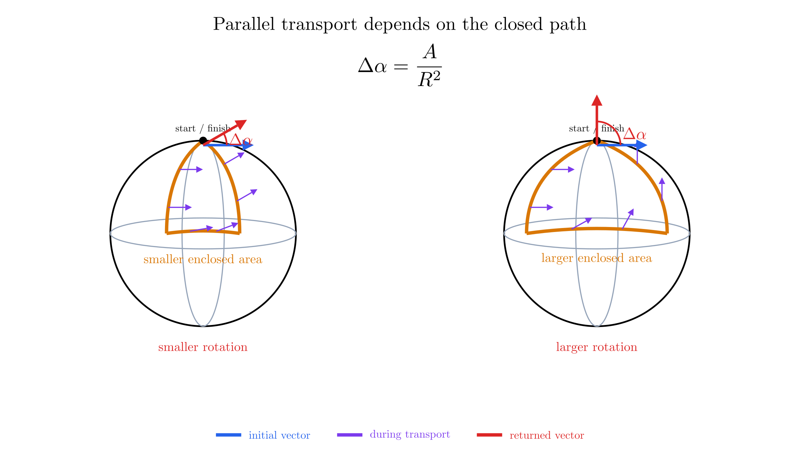
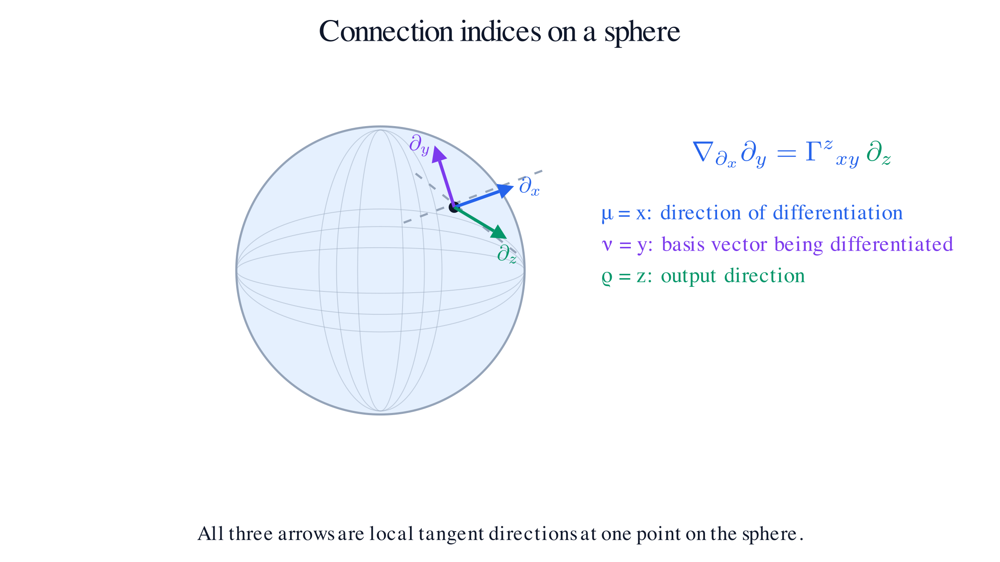

# Spacetime

The previous chapter introduced tensors as objects whose meaning survives a change of coordinates. We now use that language to describe space and time. Our starting point is a physical question: when two observers move relative to one another, which measurements change, and which relationships remain the same?

We will first build the geometry of special relativity. Then we will allow the metric to vary across a manifold and develop the tools needed to compare directions at different events. Throughout this chapter, $x^0=ct$, Greek indices run from $0$ to $3$, and the spacetime signature is $(+,-,-,-)$. Latin indices will also be used for lower-dimensional geometric examples.

## Special Relativity

Imagine a laboratory moving uniformly past another laboratory. An experiment performed entirely inside either one should not reveal a preferred state of rest. This is the **principle of relativity**: the laws of physics have the same form in every inertial frame.

An **inertial frame** is one in which a body subject to no net force moves at constant velocity. Special relativity combines the relativity principle with a second statement: light in vacuum has the same speed $c$ in every inertial frame.

The second statement is surprising because ordinary velocities depend on the observer. A ball thrown forward inside a moving train travels faster relative to the platform than relative to the train. Light does not follow that familiar addition rule.

To reconcile these statements, we must examine how observers assign coordinates to an **event**, such as a flash of light. Each frame uses rulers and synchronized clocks to assign a place and a time. Agreement about the event does not require agreement about its four coordinate labels.

## Galilean Transform

Let $S'$ move at constant speed $v$ in the positive $x$ direction relative to $S$. Choose their origins to coincide at $t=t'=0$. Newtonian mechanics relates their coordinates through the **Galilean transformation**:

$$t'=t,\qquad x'=x-vt,\qquad y'=y,\qquad z'=z.$$

The moving origin follows $x=vt$, so subtracting $vt$ gives the position relative to that origin. Both frames use the same time. Differentiation gives

$$u'_x=u_x-v,$$

where $u_x=dx/dt$ is a particle's velocity in $S$.

This transformation preserves spatial distances between simultaneous events and preserves time intervals. However, a light ray satisfying $x=ct$ would satisfy $x'=(c-v)t'$. Its speed in $S'$ would be $c-v$, contradicting the second postulate.

The conflict tells us which assumption to reconsider: observers in relative motion cannot share the same universal time coordinate.

## Lorentz Boost

A **Lorentz boost** relates inertial frames in relative motion without rotating their spatial axes. For motion along $x$, define

$$\beta=\frac{v}{c},\qquad \gamma=\frac{1}{\sqrt{1-\beta^2}}.$$

The transformation is

$$ct'=\gamma(ct-\beta x),\qquad x'=\gamma(x-\beta ct),\qquad y'=y,\qquad z'=z.$$

The time coordinate now depends on position as well as time. For two events simultaneous in $S$, with $\Delta t=0$,

$$\Delta t'=-\gamma\frac{v\,\Delta x}{c^2}.$$

If the events occur at different positions along the direction of motion, they are generally not simultaneous in $S'$. This is the **relativity of simultaneity**.

Taking the ratio of the transformed differentials gives the velocity transformation:

$$u'_x=\frac{u_x-v}{1-u_xv/c^2}.$$

Setting $u_x=c$ gives $u'_x=c$. When the relevant speeds are small compared with $c$, the denominator approaches $1$, recovering the Galilean velocity rule.

Why the Lorentz factor appears

Homogeneity and the equivalence of inertial frames motivate a linear transformation. Requiring the rays $x=ct$ and $x=-ct$ to remain light rays leads to the form

$$x'=A(v)(x-vt),\qquad t'=A(v)\left(t-\frac{vx}{c^2}\right).$$

The inverse transformation has relative velocity $-v$. Spatial isotropy gives $A(-v)=A(v)$. Composing the two transformations yields

$$x=A(v)^2\left(1-\frac{v^2}{c^2}\right)x.$$

Thus $A(v)^2(1-v^2/c^2)=1$. Choosing the positive branch that becomes the identity at $v=0$ gives $A(v)=\gamma$.

## Lorentz Invariant

Observers disagree about the time and spatial separation of events, but they agree about the **spacetime interval**:

$$\Delta s^2=c^2\Delta t^2-\Delta x^2-\Delta y^2-\Delta z^2.$$

A quantity unchanged under Lorentz transformations is a **Lorentz invariant**. The interval plays a role analogous to the squared distance preserved by rotations in Euclidean space, although its minus signs give it a different geometry.

Checking that a boost preserves the interval

For the time and longitudinal terms,

$$c^2\Delta t'^2-\Delta x'^2
=\gamma^2\left[(c\Delta t-\beta\Delta x)^2-(\Delta x-\beta c\Delta t)^2\right].$$

The cross terms cancel, leaving

$$\gamma^2(1-\beta^2)\left(c^2\Delta t^2-\Delta x^2\right)
=c^2\Delta t^2-\Delta x^2.$$

The transverse coordinates are unchanged, so the full interval is preserved.

The sign has a physical meaning. A **timelike** separation has $\Delta s^2>0$ and can join two events on a massive observer's worldline. A **null** separation has $\Delta s^2=0$ and can join events along a light ray. A **spacelike** separation has $\Delta s^2<0$; neither event can send a causal signal to the other in Minkowski spacetime.

Preserving the interval preserves this classification. Lorentz transformations that preserve the direction of time also preserve the causal ordering of timelike and null separated events.

## Need for Spacetime

A spatial description asks where something is at a chosen time. But a different observer divides events into simultaneous groups differently. A description built from space alone therefore hides part of the transformation.

**Spacetime** treats an event as one point with four coordinates. A moving particle traces a **worldline** through these events. Different observers assign different coordinates to the same worldline, while agreeing about invariant measurements along it.

For a timelike worldline, a clock carried by the particle measures **proper time**:

$$c^2d\tau^2=ds^2=c^2dt^2-d\mathbf{x}^2.$$

Writing $u^2=d\mathbf{x}^2/dt^2$ gives

$$d\tau=dt\sqrt{1-\frac{u^2}{c^2}}.$$

The total elapsed time is the integral of $d\tau$ along the worldline. Two clocks that separate and later meet can record different times because they followed different paths through spacetime.

Time remains physically distinct from space: a massive observer must follow a timelike path, and the metric distinguishes time directions from spatial directions. Combining them into one manifold makes their relationship explicit.

## Minkowski Metric

The interval can be written using the tensor notation of the previous chapter:

$$ds^2=\eta_{\mu\nu}dx^\mu dx^\nu,\qquad
\eta_{\mu\nu}=
\begin{pmatrix}
1&0&0&0\\
0&-1&0&0\\
0&0&-1&0\\
0&0&0&-1
\end{pmatrix}.$$

The tensor $\eta$ is the **Minkowski metric**, expressed here in inertial Cartesian coordinates. It pairs two vectors to produce the invariant scalar

$$\eta(V,W)=\eta_{\mu\nu}V^\mu W^\nu.$$

In matrix notation, a Lorentz transformation $\Lambda$ obeys

$$\Lambda^{\mathsf T}\eta\Lambda=\eta.$$

This condition says that the transformation preserves the metric pairing.

For a massive particle, the **four-velocity** is $U^\mu=dx^\mu/d\tau$. Dividing the proper-time relation by $d\tau^2$ gives

$$\eta_{\mu\nu}U^\mu U^\nu=c^2.$$

Its components change between frames, but its squared norm remains $c^2$. The Minkowski metric also lowers indices: $V_0=V^0$ and $V_i=-V^i$ for spatial indices in these coordinates.

## Riemannian Space

Before allowing spacetime to curve, it helps to distinguish two kinds of metric geometry. A **Riemannian space** is a smooth manifold with a smooth, positive-definite metric. Every nonzero tangent vector has positive squared length:

$$g(V,V)>0\qquad\text{for }V\ne0.$$

Euclidean space is Riemannian, as is the surface of a sphere with its usual distance rule. For a sphere of radius $a$,

$$d\ell^2=a^2d\theta^2+a^2\sin^2\theta\,d\phi^2.$$

The length of a curve $x^i(\lambda)$ is

$$L=\int\sqrt{g_{ij}\frac{dx^i}{d\lambda}\frac{dx^j}{d\lambda}}\,d\lambda.$$

Positive definiteness ensures a positive length for every nonzero tangent displacement. It does not require flatness: the plane and the sphere are both Riemannian, although their intrinsic curvatures differ.

The polar metric $d\ell^2=dr^2+r^2d\phi^2$ also shows that position-dependent components do not establish curvature. They may simply reflect a changing coordinate basis.

## Lorentz Space

A **Lorentzian space**, or Lorentzian manifold, has a nondegenerate metric with one time direction and the remaining directions spatial. In four dimensions, our sign convention is $(+,-,-,-)$.

At each point, a suitable basis puts the metric into the Minkowski form. Nonzero vectors can then have positive, negative, or zero squared norm. In particular, a null vector is nonzero even though

$$g(V,V)=0.$$

This does not make the metric degenerate. Degeneracy would mean that a nonzero vector pairs to zero with *every* vector, a stronger and different condition.

Minkowski spacetime is flat Lorentzian geometry. General relativity uses Lorentzian geometry that can be curved. **Signature** specifies the types of directions available at each point; **curvature** describes how the geometry varies between points.

The collection of null directions forms a light cone in each tangent space. These cones determine the locally allowed directions of light and causal motion.

## Metric Tensor

The **metric tensor** is the field that supplies these measurement rules throughout spacetime:

$$g=g_{\mu\nu}\,dx^\mu\otimes dx^\nu,\qquad
ds^2=g_{\mu\nu}(x)dx^\mu dx^\nu.$$

It is symmetric, $g_{\mu\nu}=g_{\nu\mu}$, and nondegenerate, so its component matrix has an inverse:

$$g^{\mu\rho}g_{\rho\nu}=\delta^\mu{}_\nu.$$

Under a coordinate change, its two lower indices transform as

$$g'_{\alpha\beta}
=\frac{\partial x^\mu}{\partial x'^\alpha}
\frac{\partial x^\nu}{\partial x'^\beta}g_{\mu\nu}.$$

Substituting the transformed coordinate differentials into $ds^2$ cancels these Jacobian factors. The coordinate components change, while the interval does not.

For example, flat spacetime in spherical spatial coordinates has

$$ds^2=c^2dt^2-dr^2-r^2d\theta^2-r^2\sin^2\theta\,d\phi^2.$$

Here the components vary even though the spacetime is flat. We need a way to distinguish changes caused by coordinates from changes intrinsic to the geometry.

In curved spacetime, $ds^2$ is a local rule for tangent displacements. We generally cannot find a finite interval by inserting a finite coordinate difference into the metric at one endpoint. Proper time instead comes from integrating along a specified timelike path.

## Parallel Transport

The previous chapter emphasized that vectors at different points belong to different tangent spaces. A vector at $p$ cannot be subtracted directly from a vector at $q$ without a rule for comparing them.

**Parallel transport** is such a rule along a chosen path. In a Euclidean plane, we can slide an arrow while preserving its Cartesian direction. On a curved surface, we compare successive nearby arrows using the local geometry.

Consider the sphere example from the previous chapter. Transporting a tangent arrow around a closed loop can return it rotated relative to its original direction. Each short step follows the same local rule, yet the accumulated result depends on the route.

Thus parallel transport is a rule along a path, not generally a path-independent identification of all tangent spaces. To turn this idea into a calculation, we introduce a connection.

## Connection

A **connection** assigns a derivative $\nabla_X V$ to a vector field $V$ in a direction $X$. Here $f$ is a scalar function of location, so it assigns one number to each point. The connection is linear in the direction and obeys the product rule

$$\nabla_X(fV)=X[f]\,V+f\nabla_XV.$$

![Three panels illustrate the product rule at one point: the purple vector X[f]V lies along V, the green vector f∇_X V is perpendicular in this example of turning at fixed length, and their tip-to-tail sum is the blue covariant derivative ∇_X(fV). The arrows represent rates of change; in general the vector term can change both length and direction.](./manim/product-rule-decomposition.png)

This derivative compares nearby vectors using the transport rule. It corrects for the fact that coordinate basis vectors themselves can change from point to point.

In a coordinate basis, define the connection coefficients by

$$\nabla_{\partial_\mu}\partial_\nu
=\Gamma^\rho{}_{\mu\nu}\partial_\rho.$$

The first lower index specifies the direction of differentiation; the second labels the basis vector being differentiated. The upper index labels the output component.

For $V=V^\nu\partial_\nu$, the product rule gives

$$\nabla_{\partial_\mu}V
=\left(\partial_\mu V^\rho+\Gamma^\rho{}_{\mu\nu}V^\nu\right)\partial_\rho.$$

The first term differentiates the components. The second accounts for the changing basis. A manifold can admit many connections; a metric will select a particular one once we impose two additional conditions below.

## Christoffel Symbols

The coefficients $\Gamma^\rho{}_{\mu\nu}$ are often called **Christoffel symbols**, especially for the connection determined by a metric. They describe a connection in a particular coordinate basis. Their indices have distinct roles:

$$\nabla_{\partial_\mu}\partial_\nu
=\Gamma^\rho{}_{\mu\nu}\partial_\rho.$$

The index $\mu$ identifies the direction in which we differentiate, $\nu$ identifies the basis vector being differentiated, and $\rho$ identifies the component of the resulting vector. The upper position of $\rho$ reflects that output-vector role; the lower positions of $\mu$ and $\nu$ reflect the two covariant inputs to the connection. In this sense the notation resembles a tensor of type $(1,2)$.

In plain language, $\nabla_{\partial_\mu}\partial_\nu$ asks: “As I move in the $\partial_\mu$ direction, how does the basis vector $\partial_\nu$ change?” The answer is another vector, which we decompose in the basis:

$$\nabla_{\partial_\mu}\partial_\nu
=\Gamma^\rho{}_{\mu\nu}\partial_\rho.$$

For a fixed value of $\rho$, $\Gamma^\rho{}_{\mu\nu}$ is the coefficient of the $\partial_\rho$ component of that change. The derivative direction is therefore $\partial_\mu$; the vector being moved is $\partial_\nu$; and the output component being read is along $\partial_\rho$.

In four-dimensional spacetime, each index can take four values, $0,1,2,3$. Therefore the array $\Gamma^\rho{}_{\mu\nu}$ has

$$4\times4\times4=64$$

indexed components for a general connection. We have not yet imposed any symmetry, so we count all 64 at this stage. Later, when we introduce the torsion-free Levi-Civita connection, the lower indices will be symmetric, $\Gamma^\rho{}_{\mu\nu}=\Gamma^\rho{}_{\nu\mu}$, leaving 40 independent components.

However, $\Gamma^\rho{}_{\mu\nu}$ is not a tensor. Under a coordinate change, differentiating the transformed basis introduces terms containing second derivatives of the coordinate transformation. Those extra terms do not fit the tensor transformation law. The covariant derivative combines these non-tensorial coefficients with the ordinary derivative so that $\nabla_\mu V^\rho$ does transform as a tensor. Thus index placement records how the indices are used; it does not by itself guarantee that the whole collection of components is a tensor.

For a concrete three-dimensional example, set $\mu=x$, $\nu=y$, and $\rho=z$. Then

$$\nabla_{\partial_x}\partial_y=\Gamma^z{}_{xy}\,\partial_z.$$

A useful example is the Euclidean plane in polar coordinates. For its usual metric connection, the nonzero symbols are

$$\Gamma^r{}_{\phi\phi}=-r,\qquad
\Gamma^\phi{}_{r\phi}=\Gamma^\phi{}_{\phi r}=\frac1r.$$

Even a constant Cartesian vector has changing polar components. For the unit vector in the positive $x$ direction,

$$V=\partial_x=\cos\phi\,\partial_r-\frac{\sin\phi}{r}\,\partial_\phi.$$

The component derivatives are nonzero, but the connection corrections cancel them. For example,

$$\partial_\phi V^r+\Gamma^r{}_{\phi\phi}V^\phi
=-\sin\phi+(-r)\left(-\frac{\sin\phi}{r}\right)=0.$$

The vector is constant in the geometric sense, despite its changing components. Nonzero Christoffel symbols alone therefore do not demonstrate intrinsic curvature.

## Covariant Derivative

The resulting tensorial derivative is the **covariant derivative**. For a vector,

$$\nabla_\mu V^\nu
=\partial_\mu V^\nu+\Gamma^\nu{}_{\mu\rho}V^\rho.$$

For a covector, the correction has the opposite sign:

$$\nabla_\mu\omega_\nu
=\partial_\mu\omega_\nu-\Gamma^\rho{}_{\mu\nu}\omega_\rho.$$

Why the opposite sign? The contraction $\omega_\nu V^\nu$ is a scalar, so its derivative must be its ordinary partial derivative. Applying the product rule makes the two connection corrections cancel.

Each upper index receives a plus correction and each lower index a minus correction. For a mixed tensor,

$$\nabla_\lambda T^\mu{}_\nu
=\partial_\lambda T^\mu{}_\nu
+\Gamma^\mu{}_{\lambda\rho}T^\rho{}_\nu
-\Gamma^\rho{}_{\lambda\nu}T^\mu{}_\rho.$$

For a scalar $f$, $\nabla_\mu f=\partial_\mu f$. Its second covariant derivative generally includes a connection term, because its first derivative is a covector.

Along a curve with tangent $\dot{x}^\mu=dx^\mu/d\lambda$, define

$$\frac{DV^\rho}{d\lambda}
=\frac{dV^\rho}{d\lambda}
+\Gamma^\rho{}_{\mu\nu}\dot{x}^\mu V^\nu.$$

Parallel transport is the equation $DV^\rho/d\lambda=0$. A curve that parallel transports its own tangent is an affinely parametrized **geodesic**:

$$\frac{d^2x^\rho}{d\lambda^2}
+\Gamma^\rho{}_{\mu\nu}\frac{dx^\mu}{d\lambda}\frac{dx^\nu}{d\lambda}=0.$$

## Levi-Civita Connection

General relativity uses the **Levi-Civita connection**, the unique connection that is both metric-compatible and torsion-free.

**Metric compatibility** means

$$\nabla_\lambda g_{\mu\nu}=0.$$

It ensures that parallel transport preserves the inner product of two transported vectors. In particular, a transported vector retains its timelike, null, or spacelike character.

**Torsion-freedom**[^torsion-scope] means that the connection has no antisymmetric part beyond the noncommutativity of the vector fields themselves. The torsion tensor is

$$T(X,Y)=\nabla_XY-\nabla_YX-[X,Y].$$

It compares the result of differentiating $Y$ along $X$ with the result of differentiating $X$ along $Y$, after subtracting the ordinary Lie bracket $[X,Y]$. Vanishing torsion means

$$T(X,Y)=0.$$

For a coordinate basis, $[\partial_\mu,\partial_\nu]=0$, so this becomes

$$\Gamma^\rho{}_{\mu\nu}=\Gamma^\rho{}_{\nu\mu}.$$

This condition concerns the connection coefficients at one point and does not say that vectors return unchanged after transport around a loop. That latter effect is curvature. A connection can therefore be torsion-free and curved, as the Levi-Civita connection on a sphere is.

Together these conditions determine the connection from the metric:

$$\Gamma^\rho{}_{\mu\nu}
=\frac12g^{\rho\sigma}
\left(\partial_\mu g_{\nu\sigma}
+\partial_\nu g_{\mu\sigma}
-\partial_\sigma g_{\mu\nu}\right).$$

Deriving the metric connection

Expand metric compatibility:

$$\partial_\mu g_{\nu\sigma}
=\Gamma^\rho{}_{\mu\nu}g_{\rho\sigma}
+\Gamma^\rho{}_{\mu\sigma}g_{\nu\rho}.$$

Write the two analogous equations with derivative indices $\nu$ and $\sigma$. Add the first two and subtract the third. Symmetry in the lower connection indices gives

$$\partial_\mu g_{\nu\sigma}
+\partial_\nu g_{\mu\sigma}
-\partial_\sigma g_{\mu\nu}
=2g_{\rho\sigma}\Gamma^\rho{}_{\mu\nu}.$$

Multiplication by $g^{\lambda\sigma}/2$ isolates $\Gamma^\lambda{}_{\mu\nu}$ and gives the formula above.

For this connection, normal coordinates at an event $p$ can make $g_{\mu\nu}(p)=\eta_{\mu\nu}$ and $\Gamma^\rho{}_{\mu\nu}(p)=0$. These are local statements: they do not generally remove derivatives of the connection or make a whole curved region Minkowskian.

The torsion-free condition also reduces the number of independent Christoffel symbols. In four dimensions, the 64 components $\Gamma^\rho{}_{\mu\nu}$ are symmetric in the lower pair $(\mu,\nu)$, leaving $4\times10=40$ independent components.

## Riemann Tensor

To detect what cannot be removed by coordinates, compare covariant differentiation in two different orders. For the Levi-Civita connection, we define the **Riemann tensor** by

Geometrically, the same idea appears through parallel transport. Carry a vector around a sufficiently small, contractible closed curve and compare it with the vector you started with. If it returns changed, the loop encloses curvature. Conversely, vanishing Riemann curvature makes parallel transport path-independent locally, so vectors return unchanged around such small loops. A flat space can still have global holonomy when its topology has nontrivial loops; the local statement is the one captured by the Riemann tensor.

$$[\nabla_\mu,\nabla_\nu]V^\rho
=R^\rho{}_{\sigma\mu\nu}V^\sigma.$$

The square brackets denote a **commutator**:

$$[A,B]=AB-BA.$$

Therefore the definition means explicitly

$$\nabla_\mu\!\left(\nabla_\nu V^\rho\right)
-\nabla_\nu\!\left(\nabla_\mu V^\rho\right)
=R^\rho{}_{\sigma\mu\nu}V^\sigma.$$

We first differentiate $V^\rho$ in the $\nu$ direction and then in the $\mu$ direction. We then reverse the order and subtract. In flat Cartesian coordinates these two operations agree; in curved geometry their difference measures curvature.

This construction is independent of the coordinates used to describe the manifold. The individual connection coefficients can change, or even vanish at one event, under a coordinate change; the Riemann tensor transforms as a genuine tensor. Therefore the statement that curvature is nonzero is an intrinsic statement about the geometry, rather than an artifact of a particular coordinate system.

Our sign and index convention gives

$$R^\rho{}_{\sigma\mu\nu}
=\partial_\mu\Gamma^\rho{}_{\nu\sigma}
-\partial_\nu\Gamma^\rho{}_{\mu\sigma}
+\Gamma^\rho{}_{\mu\lambda}\Gamma^\lambda{}_{\nu\sigma}
-\Gamma^\rho{}_{\nu\lambda}\Gamma^\lambda{}_{\mu\sigma}.$$

The last two indices specify the two derivative directions. The second index contracts with the input vector, and the first labels the resulting vector. Reversing the derivative order reverses the sign:

$$R^\rho{}_{\sigma\mu\nu}=-R^\rho{}_{\sigma\nu\mu}.$$

Although its formula uses non-tensorial connection coefficients, their extra transformation terms cancel in this combination. The result is a tensor. If it is nonzero at an event, no change of coordinates can make all its components vanish there.

In four dimensions, a component such as $R^\rho{}_{\sigma\mu\nu}$ has four choices for each of its four indices, so there are initially

$$4^4=256$$

indexed components. The reduction proceeds in stages:

1. Antisymmetry in the last pair, $R_{\rho\sigma\mu\nu}=-R_{\rho\sigma\nu\mu}$, leaves $4\times4\times6=96$ components.
2. Antisymmetry in the first pair and symmetry under exchanging the two pairs, $R_{\rho\sigma\mu\nu}=R_{\mu\nu\rho\sigma}$, lets us view the tensor as a symmetric $6\times6$ matrix, leaving $6\times7/2=21$ components.
3. The **first Bianchi identity** removes one further component. For a torsion-free connection it is

   $$R^\rho{}_{\sigma\mu\nu}+R^\rho{}_{\mu\nu\sigma}+R^\rho{}_{\nu\sigma\mu}=0.$$

   It says that the cyclic sum over the last three indices vanishes, leaving 20 independent components. Geometrically, imagine making three infinitesimal moves in the directions labelled by $\sigma$, $\mu$, and $\nu$. For a torsion-free connection, the three cyclic ways of comparing the resulting tiny loops cancel. The curvature can depend on the order of two moves, but these three order effects are not independent.

Thus 256 is the raw array size, while 20 is the independent curvature information for a four-dimensional Levi-Civita connection.

In normal coordinates at that event, the connection-product terms vanish, but the derivatives of the connection can remain. This is why making the connection zero at one point does not eliminate curvature.

## Curvature

The Riemann tensor is the local measure of **intrinsic curvature**. It describes the leading change in a vector transported around an infinitesimal loop. For the metric connection, vanishing Riemann curvature throughout a region means that the metric is locally flat there; global identifications can still matter.

We can now check the distinction between a curved coordinate grid and a curved space.

Comparing the flat polar plane with a sphere

For the polar plane, use the Christoffel symbols given above. The component

$$R^r{}_{\phi r\phi}
=\partial_r\Gamma^r{}_{\phi\phi}
-\Gamma^r{}_{\phi\phi}\Gamma^\phi{}_{r\phi}
=-1-(-r)\frac1r=0.$$

In two dimensions this component determines the curvature through the tensor symmetries, so the polar plane is flat.

For a sphere with metric $d\ell^2=a^2(d\theta^2+\sin^2\theta\,d\phi^2)$, the nonzero symbols are

$$\Gamma^\theta{}_{\phi\phi}=-\sin\theta\cos\theta,\qquad
\Gamma^\phi{}_{\theta\phi}=\Gamma^\phi{}_{\phi\theta}=\cot\theta.$$

The analogous calculation gives

$$R^\theta{}_{\phi\theta\phi}
=\partial_\theta(-\sin\theta\cos\theta)
-(-\sin\theta\cos\theta)\cot\theta
=\sin^2\theta.$$

Lowering the first index yields $R_{\theta\phi\theta\phi}=a^2\sin^2\theta$. The Gaussian curvature is

$$K=\frac{R_{\theta\phi\theta\phi}}
{g_{\theta\theta}g_{\phi\phi}-g_{\theta\phi}^2}
=\frac1{a^2}.$$

The component depends on coordinates, while this scalar gives the same curvature at every point of the sphere.

In spacetime, curvature reveals itself through **tidal acceleration**. Two nearby freely falling objects can each feel no proper acceleration while their separation changes. A freely falling frame can remove the connection at one event, but it cannot generally remove the relative acceleration of neighboring objects across a finite region. The precise geodesic-deviation equation is derived later, after geodesics have been introduced.

## Bianchi Identities

The Riemann tensor satisfies two related identities. They follow from the definition of curvature and the symmetries of the Levi-Civita connection; they are not additional field equations.

The **algebraic, or first, Bianchi identity** is the cyclic relation

$$R^\rho{}_{\sigma\mu\nu}
+R^\rho{}_{\mu\nu\sigma}
+R^\rho{}_{\nu\sigma\mu}=0.$$

It is the identity used above when counting the independent components of the Riemann tensor. The cyclic sum over the last three indices vanishes.

Proof sketch of the algebraic Bianchi identity

For a torsion-free connection, the curvature operator satisfies

$$R(X,Y)Z+R(Y,Z)X+R(Z,X)Y=0.$$

This follows by expanding each curvature operator in terms of covariant derivatives. The terms with two derivatives cancel in pairs because the commutator is antisymmetric, and the remaining connection terms cancel because torsion vanishes. Choosing $X=\partial_\mu$, $Y=\partial_\nu$, and $Z=\partial_\sigma$, then reading the $\partial_\rho$ component, gives the indexed identity above.

The **differential, or second, Bianchi identity** applies a covariant derivative:

$$\nabla_\lambda R^\rho{}_{\sigma\mu\nu}
+\nabla_\mu R^\rho{}_{\sigma\nu\lambda}
+\nabla_\nu R^\rho{}_{\sigma\lambda\mu}=0.$$

Proof sketch of the differential Bianchi identity

Covariant derivatives obey the operator Jacobi identity

$$[\nabla_\lambda,[\nabla_\mu,\nabla_\nu]]
+[\nabla_\mu,[\nabla_\nu,\nabla_\lambda]]
+[\nabla_\nu,[\nabla_\lambda,\nabla_\mu]]=0.$$

Apply this to a vector field and replace each inner commutator with the Riemann tensor. The outer derivatives then produce the three cyclic covariant derivatives of $R$. Terms in which one connection acts on the vector cancel by the same Jacobi identity, leaving precisely the differential Bianchi identity.

Contracting indices in this identity gives

$$\nabla_\mu R^{\mu\nu}=\frac12\nabla^\nu R.$$

This contracted form is what makes the Einstein tensor divergence-free. It will be important when we connect geometry to conserved energy and momentum.

## Ricci Tensor

The Riemann tensor contains several kinds of directional information. Contraction produces a simpler tensor, the **Ricci tensor**:

$$R_{\mu\nu}=R^\rho{}_{\mu\rho\nu}.$$

Here the upper index is paired with the first derivative-direction index. For the Levi-Civita connection, the result is symmetric: $R_{\mu\nu}=R_{\nu\mu}$. Contracting again with the inverse metric gives the **Ricci scalar**, or scalar curvature:

$$R=g^{\mu\nu}R_{\mu\nu}.$$

For the two-sphere computed above,

$$R_{\theta\theta}=1,\qquad R_{\phi\phi}=\sin^2\theta,$$

so

$$R=\frac1{a^2}+\frac{\sin^2\theta}{a^2\sin^2\theta}
=\frac2{a^2}=2K.$$

The equality $R=2K$ is specific to two-dimensional geometry. In four-dimensional spacetime, contraction loses information: $R_{\mu\nu}=0$ does not imply that the full Riemann tensor vanishes. The vacuum exterior of a spherical mass, for example, can have nonzero tidal curvature while its Ricci tensor is zero.

Ricci curvature enters the evolution of the volume of a small bundle of geodesics. The remaining, trace-free part of the four-dimensional Riemann tensor is the **Weyl tensor**, which describes tidal distortion not fixed by the Ricci tensor.

One final combination will be useful later:

$$G_{\mu\nu}=R_{\mu\nu}-\frac12Rg_{\mu\nu}.$$

This is the **Einstein tensor**. By the contracted Bianchi identity,

$$\nabla_\mu G^{\mu\nu}=0.$$

This is the geometric identity underlying the Einstein tensor's role in the field equations.

> **Looking ahead.** The metric supplies measurements, its Levi-Civita connection supplies differentiation and parallel transport, and curvature measures the local failure of transport to be path-independent. [Geodesics](geodesics.md) develops the resulting equations of free fall; [Einstein's equations](einstein-equations.md) connects spacetime geometry to matter and energy.

For further discussion of connections, transport, and curvature, see [David Tong's notes on Riemannian geometry](https://www.damtp.cam.ac.uk/user/tong/gr/grhtml/S3.html). When comparing formulas, check both the metric signature and the definition of the Riemann tensor.

[^torsion-scope]: The full geometric theory of torsion belongs to more advanced differential geometry and is outside the scope of this chapter. Standard general relativity chooses the metric-compatible, torsion-free Levi-Civita connection and uses coordinate charts, so the additional torsion formalism is not needed for the developments here.
