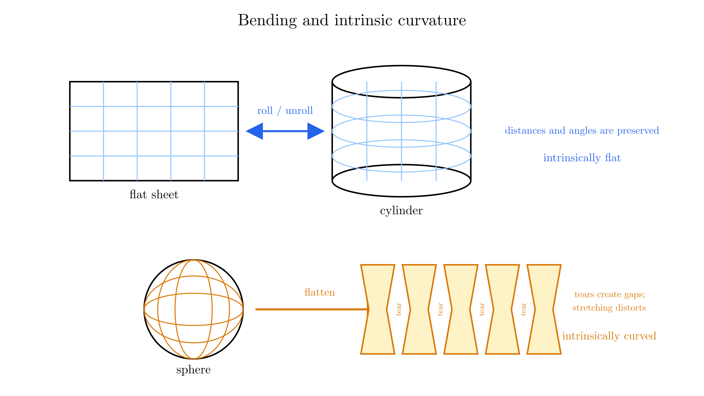
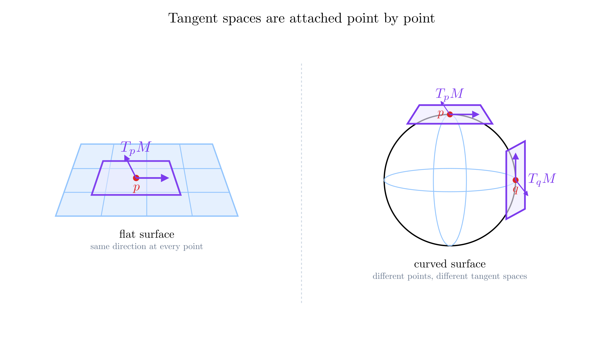
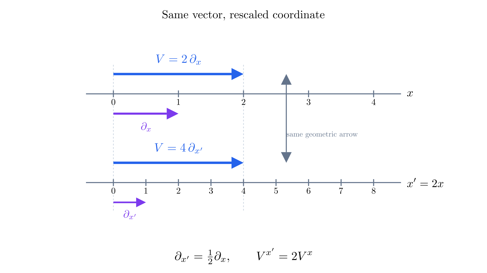
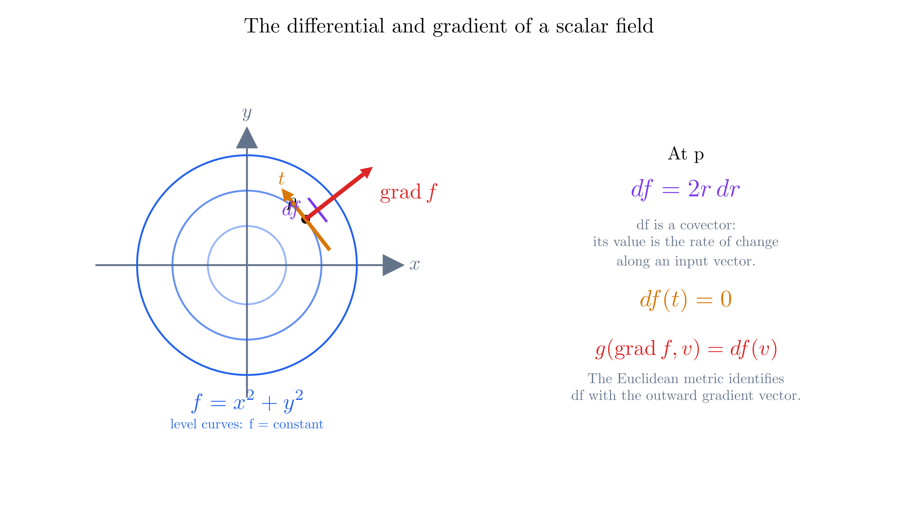
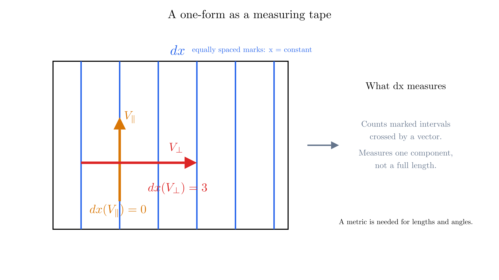
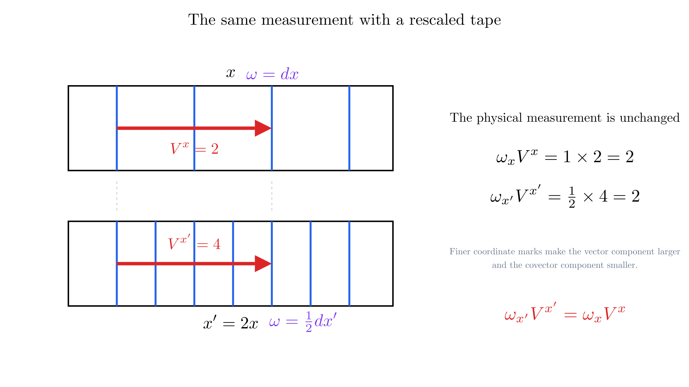
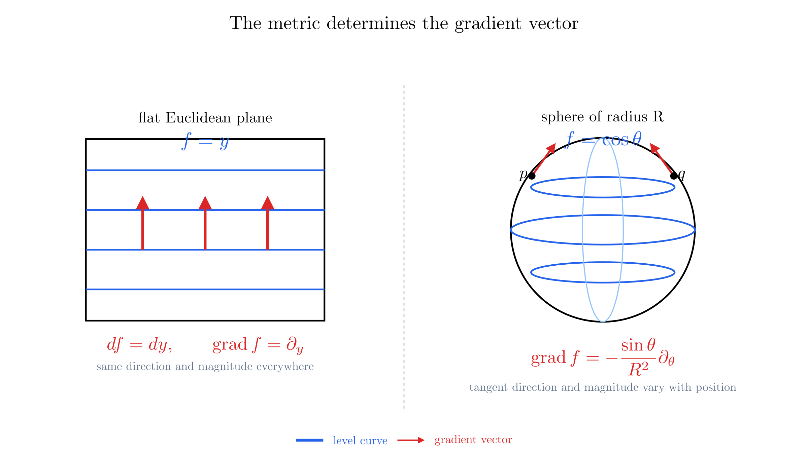

# Differential Geometry

Differential geometry studies smooth spaces using calculus. It gives us a language for describing directions, measurements, and curvature without making the answer depend on the coordinates we choose. We will build that language step by step, beginning with familiar geometry and ending with the tensors used in general relativity.

## What Is Analytic Geometry?

**Analytic geometry**, also called analytical geometry, describes geometric objects using coordinates and equations. Choosing Cartesian axes turns a point in a plane into a pair of numbers $(x,y)$. A circle of radius $R$ centered at the origin then becomes the equation

$$x^2+y^2=R^2.$$

The circle is the geometric object; the equation describes it in a particular coordinate system. In polar coordinates, the same circle has the simpler equation $r=R$. Changing coordinates changes the description, not the circle.

Coordinates also let us use algebra to answer geometric questions. Intersections become simultaneous equations, and the distance between two points in a Euclidean plane is

$$d^2=(x_2-x_1)^2+(y_2-y_1)^2.$$

This formula assumes Cartesian coordinates and Euclidean geometry. One of our central questions will be how to express measurements when those assumptions no longer hold.

## Extrinsic and Intrinsic Geometry

**Extrinsic geometry** studies a space through the way it sits inside a larger space. We can picture a sphere as a surface embedded in three-dimensional Euclidean space, and describe its bending using the surrounding space.

**Intrinsic geometry** studies measurements made within the space itself. Imagine observers confined to a surface who can measure lengths, angles, and the paths of freely moving objects. They can investigate its geometry without referring to a direction pointing away from the surface.

A flat sheet rolled into a cylinder illustrates the distinction. Imagine rolling a sheet of aluminium foil around a tube without stretching, crumpling, or creasing it. Unroll the foil and it lies flat again: lines drawn on it retain their lengths, intersect at the same angles, and enclose the same areas. Rolling changed how the sheet sits in three-dimensional space, but it did not change measurements made within the sheet.

This is the sense in which a cylinder is **intrinsically flat**. Cut it along a straight line parallel to its axis and unroll it, and the surface becomes a rectangle without distortion. If $u$ measures distance around the cylinder and $v$ measures distance along its axis, an embedding of a cylinder of radius $R$ is

$$\mathbf{X}(u,v)=\left(R\cos\frac{u}{R},\ R\sin\frac{u}{R},\ v\right).$$

The squared distance between nearby points on its surface is

$$d\ell^2=du^2+dv^2,$$

exactly the Euclidean plane's distance rule in Cartesian coordinates. Its **Gaussian curvature** is therefore zero. The cylinder still has extrinsic curvature because its surface normal changes as we move around it. It also differs globally from the plane: moving far enough in the $u$ direction returns to the starting point.

A sphere cannot be treated this way. Its intrinsic distance rule is

$$d\ell^2=R^2\left(d\theta^2+\sin^2\theta\,d\phi^2\right),$$

and its Gaussian curvature is $1/R^2$. Flattening a spherical shell cannot preserve all distances and angles. If the material cannot stretch, it must buckle or tear apart; cutting it into narrow strips lets the strips lie flatter only by opening gaps between them. Every flat map of Earth therefore distorts lengths, areas, angles, or some combination of them.

Flatness is thus an intrinsic claim about a metric, not a claim that an object looks visually flat in a surrounding space. On a flat surface, sufficiently small geometric experiments obey Euclidean relations, parallel transport around a contractible loop returns a vector unchanged, and the intrinsic curvature vanishes. On a sphere, a triangle bounded by arcs of great circles can have an angle sum greater than $\pi$, and parallel transport around a loop can rotate a vector. Observers confined to the sphere can detect these effects without looking outside it.

For these geodesic loops on a sphere of radius $R$, the rotation angle is proportional to the enclosed area $A$: $\Delta\alpha=A/R^2$. The result depends on the path even though both journeys begin and end at the same point. This failure to return unchanged is called **holonomy**, and it provides an intrinsic test of curvature.

General relativity describes the intrinsic geometry of spacetime. It does not require spacetime to bend into an additional physical dimension.

## What Is Differential Geometry?

Differential geometry combines smooth geometric spaces with differentiation and integration. Instead of asking only which points satisfy an equation, it asks how curves move through a space, what directions are available at a point, and how measurements change from point to point.

Calculus begins locally. A small segment of a smooth curve is approximated by its tangent line, and a small patch of a smooth surface is approximated by its tangent plane. Differential geometry makes these approximations precise and extends them to spaces of any dimension.

Different ingredients answer different questions. A **smooth manifold** lets us use coordinates and calculus locally. A **metric** supplies lengths and inner products. A **connection** lets us differentiate vector fields and compare directions along a path. Curvature then describes, among other things, how transporting a direction around a loop can change it.

We will first develop the objects defined at a single point. Comparing objects at different points comes later in [Curvature](curvature.md).

## Why Study Differential Geometry in General Relativity?

In special relativity, spacetime has the flat Minkowski geometry. In general relativity, the spacetime metric is a field that responds to matter and energy. It determines the proper time measured by clocks, the light cones, and the geometry governing freely falling motion.

The equivalence principle motivates this description: in a sufficiently small freely falling laboratory, physics approaches its special-relativistic form. Across an extended region, however, neighboring freely falling objects can accelerate relative to one another. These tidal effects reveal spacetime curvature.

Coordinates are labels we choose for events. A prediction such as the elapsed time on a clock cannot depend on those labels. Differential geometry gives us quantities whose coordinate descriptions may change while their physical meaning remains fixed.

Throughout these notes, Greek indices label the four spacetime coordinates, $x^0=ct$, and the spacetime signature is $(+,-,-,-)$. When an index occurs once upstairs and once downstairs in a term, we sum over it. For example, $\omega_\mu V^\mu$ means $\sum_{\mu=0}^{3}\omega_\mu V^\mu$.

## Manifold

An **$n$-dimensional manifold** is a space that locally looks like an open region of $\mathbb{R}^n$. Around each point, we can label nearby points with $n$ independent coordinates. The dimension counts the coordinates needed within the space, not those of any surrounding space used to draw it.

A circle is one-dimensional: near a point, one parameter locates another point on the circle. A sphere's surface is two-dimensional: two parameters locate a point on it. Spacetime is modeled as a four-dimensional manifold.

A coordinate map on a region is called a **chart**. A collection of charts covering the manifold is an **atlas**. Where charts overlap, their coordinates must be related by smooth, invertible transformations for the atlas to define a smooth structure.

No single chart need cover the entire space. Longitude and latitude, for example, fail to give a regular coordinate system at the poles. This is a failure of those coordinates, not a physical singularity of the sphere.

A smooth manifold by itself does not assign distances or angles. It gives us the setting for calculus; a metric will add a measurement rule.

## Curves

A **curve** is a map from an interval of real numbers into a manifold:

$$\gamma:I\longrightarrow M,\qquad \lambda\longmapsto\gamma(\lambda).$$

In a chart, this becomes a collection of coordinate functions $x^a(\lambda)$. The parameter $\lambda$ labels points along the curve; it need not be a coordinate of the manifold or a physical time.

For example, a circle in the plane can be parametrized by

$$x(\lambda)=R\cos\lambda,\qquad y(\lambda)=R\sin\lambda.$$

Changing the parameter can describe the same path with a different rate of traversal. If $\lambda=\lambda(\sigma)$, then

$$\frac{dx^a}{d\sigma}=\frac{dx^a}{d\lambda}\frac{d\lambda}{d\sigma}.$$

Thus the traced path and the parametrized curve carry different information. A regular reparametrization preserves the path, while rescaling its tangent; a decreasing reparametrization also reverses its orientation.

## Surfaces

A smooth **surface** is a two-dimensional manifold.[^hypersurface] When embedded in three-dimensional space, a patch can be described by a map $\mathbf{X}(u,v)$ whose two partial derivatives are linearly independent.

[^hypersurface]: A **hypersurface** is a submanifold with one dimension fewer than its ambient space. Thus a surface in three-dimensional space is a hypersurface, while a hypersurface in four-dimensional spacetime is three-dimensional.

For a sphere of radius $R$, a familiar parametrization is

$$\mathbf{X}(\theta,\phi)=\bigl(R\sin\theta\cos\phi,\ R\sin\theta\sin\phi,\ R\cos\theta\bigr).$$

The pair $(\theta,\phi)$ supplies coordinates on a suitable patch of the sphere. The three components of $\mathbf{X}$ describe the embedding. Keeping $\phi$ fixed traces a meridian; keeping $\theta$ fixed traces a circle of latitude.

At a regular point of the patch, $\partial\mathbf{X}/\partial\theta$ and $\partial\mathbf{X}/\partial\phi$ span its tangent plane. At a pole, the second vector vanishes, showing why this particular parametrization fails there. A different patch resolves the problem.

Surfaces give us accessible examples, but the intrinsic definitions below also work in higher dimensions without an embedding.

## Tangents

A tangent vector records the direction and rate of passage of a curve through a point. In a Euclidean embedding we can picture it as an arrow. Intrinsically, we can define it by how it differentiates scalar functions.

For a curve through $p$ at parameter value $\lambda_0$, its tangent $V$ acts on a smooth function $f$ as

$$V[f]=\left.\frac{d}{d\lambda}f(\gamma(\lambda))\right|_{\lambda_0}.$$

The chain rule gives

$$V[f]=V^a\partial_a f,\qquad V^a=\left.\frac{dx^a}{d\lambda}\right|_{\lambda_0},\qquad \partial_a=\frac{\partial}{\partial x^a}.$$

We therefore write $V=V^a\partial_a$. The vectors $\partial_a$ form a **coordinate basis**: each differentiates in the direction of one coordinate while holding the others fixed.

All tangent vectors at $p$ form the **tangent space** $T_pM$. It is an $n$-dimensional vector space, even when the manifold itself is curved. We can add vectors at the same point and multiply them by numbers.

Vectors at different points belong to different tangent spaces. Comparing them requires additional structure; there is generally no preferred way to declare two arrows at separated points parallel.

For a flat affine plane, every tangent plane has the same direction as the surface itself. We can therefore identify each $T_pM$ naturally with the plane's underlying vector space—often stated informally as “the tangent space is the surface.” Strictly, they are different kinds of objects: the surface contains points, whereas $T_pM$ contains vectors based at the particular point $p$. On a curved surface, even this natural identification between different points is unavailable without choosing a rule for transporting vectors.

## Coordinate Systems

Coordinates choose a basis as well as labels. On the Euclidean plane, Cartesian and polar coordinates are related by

$$x=r\cos\phi,\qquad y=r\sin\phi.$$

The chain rule relates their coordinate bases:

$$\partial_r=\cos\phi\,\partial_x+\sin\phi\,\partial_y,$$

$$\partial_\phi=-r\sin\phi\,\partial_x+r\cos\phi\,\partial_y.$$

The basis vector $\partial_\phi$ has Euclidean length $r$, not one. An angular coordinate change of one radian corresponds locally to a distance proportional to the radius. A coordinate basis is therefore not necessarily orthonormal.

For overlapping charts $x^a$ and $x'^a$, define the **Jacobian** by

$$J^a{}_b=\frac{\partial x'^a}{\partial x^b}.$$

It must be invertible on the overlap. The coordinate bases transform with the inverse Jacobian:

$$\partial'_a=\frac{\partial x^b}{\partial x'^a}\partial_b.$$

Polar coordinates fail at the origin, where the angle is undefined. Such coordinate failures must be distinguished from singularities of the geometry itself.

## Contravariance: A Brief Reminder

We need only one fact about vectors here: their upper-index components transform with the Jacobian,

$$V'^a=\frac{\partial x'^a}{\partial x^b}V^b.$$

This is the **contravariant transformation law**. The components compensate for the coordinate-basis change so that the vector itself stays the same.

For a simple example, replace a coordinate $x$ by $x'=2x$. Then $\partial_{x'}=\tfrac12\partial_x$ and $V^{x'}=2V^x$. Their product is unchanged. Contravariance is this compensation, not a statement that the underlying direction changes.

## Gradient

A scalar field $f$ assigns a number to each point. Its value at a fixed point does not depend on the coordinates: $f'(x')=f(x)$. Its directional derivative along $V$ is

$$V[f]=V^a\partial_a f.$$

The quantities $\partial_a f$ transform differently from vector components. The chain rule gives

$$\partial'_a f=\frac{\partial x^b}{\partial x'^a}\partial_b f.$$

The natural object formed from these derivatives is the **differential** $df$. It takes a vector as input and returns the rate at which $f$ changes along it:

$$df(V)=V[f].$$

Elementary vector calculus often calls the array of partial derivatives the gradient vector. This works directly in orthonormal Cartesian coordinates because the Euclidean metric identifies vectors with linear functions on vectors. More generally, we must distinguish the differential $df$ from the **gradient vector** $\operatorname{grad}f$, which requires a metric.[^grad-notation]

[^grad-notation]: The common notation $\nabla f$ is also used for the metric gradient. We write $\operatorname{grad}f$ here to avoid confusing it with the covariant derivative $\nabla_a$, introduced later.

For example, in the Euclidean plane let $f=x^2+y^2=r^2$. Then

$$df=2x\,dx+2y\,dy=2r\,dr.$$

These expressions represent the same rule for computing changes in $f$. After introducing the metric, we will see precisely how to turn that rule into a vector.

## Forms

A **covector**, or **one-form**, is a linear rule that takes a tangent vector and returns a real number. The differential $df$ is the main example: it sends a vector $V$ to the directional rate of change $df(V)=V[f]$.

You can picture a one-form as a **measuring tape** laid across a surface. Its evenly spaced marks define one direction of measurement. Applying the one-form to a vector tells us the signed number of marks crossed by that vector: a vector parallel to the marks gives zero, while one pointing across them gives a nonzero result. A general one-form measures a component in this sense; it does not by itself return a vector's full length. A metric supplies the additional information needed to measure lengths and angles.

In coordinates, the covector basis $dx^a$ picks out vector components: $dx^a(\partial_b)=\delta^a{}_b$, where $\delta^a{}_b$ is one when $a=b$ and zero otherwise. We can therefore write a general covector and its action on a vector as

$$\omega=\omega_a\,dx^a,\qquad \omega(V)=\omega_aV^a.$$

## Covariance

Covariance follows from a simple requirement: the number produced by a covector acting on a vector must not depend on the coordinates. In either chart,

$$\omega(V)=\omega_aV^a=\omega'_aV'^a.$$

Insert the known transformation of the vector components:

$$\omega'_aV'^a=\omega'_a\frac{\partial x'^a}{\partial x^b}V^b.$$

For this to equal $\omega_bV^b$ for every vector $V$, the covector components must transform with the inverse Jacobian:

$$\omega'_a=\frac{\partial x^b}{\partial x'^a}\omega_b.$$

This is the **covariant transformation law**, indicated by a lower index. Lower-index components transform in the opposite way to upper-index vector components so that their contraction remains a coordinate-independent scalar.

For $x'=2x$, the one-form $\omega=\omega_x\,dx$ has $\omega_{x'}=\tfrac12\omega_x$. Together with $V^{x'}=2V^x$, this gives

$$\omega_{x'}V^{x'}=\omega_xV^x.$$

In several dimensions, the cancellation follows from the inverse-matrix identity

$$\frac{\partial x^b}{\partial x'^a}\frac{\partial x'^a}{\partial x^c}=\delta^b{}_c.$$

The upper or lower position of an index therefore specifies a transformation rule, not just a typographical preference. The broader phrase **coordinate covariance** means that an equation retains its geometric meaning under coordinate changes; it does not mean that every index must be lower.

## Metric

A **metric** $g$ is a smooth assignment of symmetric, nondegenerate bilinear forms to tangent spaces. It takes two vectors at the same point and returns a number:

$$g(V,W)=g_{ab}V^aW^b,\qquad g_{ab}=g(\partial_a,\partial_b).$$

Symmetry means $g(V,W)=g(W,V)$, and bilinearity means linearity in each argument separately. Nondegeneracy means that the matrix $g_{ab}$ is invertible. On a Riemannian manifold it is positive definite, so it defines lengths and angles in the familiar way.

The Euclidean plane has line element

$$d\ell^2=dx^2+dy^2=dr^2+r^2d\phi^2.$$

Thus its polar metric components are $g_{rr}=1$, $g_{\phi\phi}=r^2$, and $g_{r\phi}=0$. A vector's squared length is $(V^r)^2+r^2(V^\phi)^2$. Position-dependent metric components do not by themselves imply curvature: this plane is still flat.

In Cartesian Euclidean coordinates, the metric matrix is the identity, $g=I$. Having $g=I$ on a coordinate region does mean the geometry there is flat. The converse is more subtle: a flat geometry need not have $g=I$ in the coordinates currently being used, as polar coordinates show. Flatness means that there **exists** a coordinate system in which the metric takes the Euclidean identity form (at least locally).

The metric turns a vector into a covector by fixing one argument:

$$V^\flat=g(V,\mathord{\cdot}),\qquad V_a=g_{ab}V^b.$$

Its inverse, defined by $g^{ab}g_{bc}=\delta^a{}_c$, reverses the operation. This is **lowering and raising indices**. In the polar example, $V_r=V^r$ but $V_\phi=r^2V^\phi$.

We can now define the gradient vector by $g(\operatorname{grad}f,V)=df(V)$ for every $V$. Its components are

$$\bigl(\operatorname{grad}f\bigr)^a=g^{ab}\partial_b f.$$

In the Euclidean polar plane this becomes

$$\operatorname{grad}f=(\partial_r f)\partial_r+\frac{1}{r^2}(\partial_\phi f)\partial_\phi.$$

The familiar Cartesian gradient is the flat-space special case of this rule. On a curved surface, the same differential $df$ becomes a gradient vector only after the intrinsic metric supplies $g^{ab}$. For example, on a sphere of radius $R$ with $f=\cos\theta$,

$$df=-\sin\theta\,d\theta,\qquad \operatorname{grad}f=-\frac{\sin\theta}{R^2}\partial_\theta.$$

The gradient remains perpendicular to the level curves, but its direction belongs to the tangent plane at each point and its magnitude varies with latitude. It vanishes at the poles, where the height function has a maximum or minimum.

A spacetime metric is Lorentzian rather than positive definite. With our signature, $g(V,V)$ is positive for timelike vectors, negative for spacelike vectors, and zero for null vectors. A nonzero vector can therefore have zero norm without the metric being degenerate. Along a timelike worldline, $ds^2=c^2d\tau^2$ relates the metric to a clock's proper time.

## Tensors

Vectors, covectors, and metrics are examples of **tensors**. At a point, a tensor of type $(r,s)$ is a multilinear map that takes $r$ covectors and $s$ vectors as inputs and returns a scalar. Multilinearity means linearity in each input while the others are held fixed.

Its components carry $r$ upper and $s$ lower indices. A vector has type $(1,0)$, a covector has type $(0,1)$, and the metric has type $(0,2)$. Scalars are tensors of type $(0,0)$.

Tensor products build objects with more slots. For example,

$$\bigl(\alpha\otimes\beta\bigr)(V,W)=\alpha(V)\beta(W).$$

The metric can be written $g=g_{ab}\,dx^a\otimes dx^b$. Its symmetry is an additional property; a general tensor with two lower indices need not be symmetric. A two-form is instead antisymmetric.

Every upper index transforms with the Jacobian, and every lower index with its inverse. For a tensor of type $(1,1)$,

$$T'^a{}_b=\frac{\partial x'^a}{\partial x^c}\frac{\partial x^d}{\partial x'^b}T^c{}_d.$$

This rule preserves the underlying multilinear map. An array of numbers is not automatically a tensor: its components must obey the appropriate transformation law.

**Contraction** pairs an upper and a lower index and sums over them. It reduces the type by $(1,1)$; for example, $T^a{}_a$ is a scalar. The metric permits other pairings by first raising or lowering an index, as in $g_{ab}V^aW^b$. In a tensor equation, each unsummed, or **free**, index must occur in the same position on both sides. For example,

$$A^a=T^a{}_bV^b$$

has free index $a$ and summed index $b$. Tensor notation makes coordinate independence explicit, but that mathematical consistency alone does not establish that an equation describes nature.

A **tensor field** assigns a tensor smoothly at each point. In general relativity, the metric $g_{\mu\nu}$, stress–energy tensor $T_{\mu\nu}$, and curvature tensor $R^\rho{}_{\sigma\mu\nu}$ are central examples. Their components vary with position and coordinate choice while the geometric fields remain well defined.

Differentiation needs additional care. The derivatives $\partial_a f$ of a scalar form a covector, but $\partial_aV^b$ do not generally form a tensor: differentiating the vector transformation law also differentiates its Jacobian. A connection supplies the correction, giving the covariant derivative

$$\nabla_aV^b=\partial_aV^b+\Gamma^b{}_{ac}V^c.$$

The coefficients $\Gamma^b{}_{ac}$ compensate for how the basis varies; they are not themselves tensor components. For the metric's Levi-Civita connection, they are determined by the metric and its first derivatives. We will develop this construction in [Curvature](curvature.md), after examining measurements more closely in [Riemannian Spaces and the Metric Tensor](riemannian-spaces-and-metric-tensor.md).
